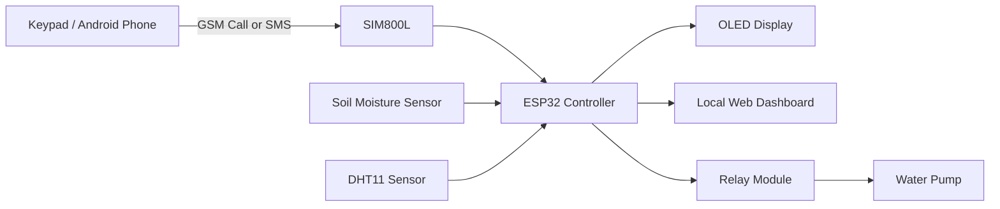

# CALL_FARM# 🌱 CALL-FARM

### Smart irrigation. Simple calls. Real impact.

<p align="center">
  <strong>Bridging the technology gap for farmers — one call at a time.</strong>
</p>

<p align="center">
  
  
  
  
</p>

<p align="center">
  <em>A hardware-first irrigation controller that lets farmers monitor and control a water pump using a basic keypad phone.</em>
</p>

---

## 🚜 The Problem

Smart agriculture is advancing rapidly, but many irrigation solutions assume that farmers have:

- A smartphone
- Reliable internet connectivity
- Access to mobile applications
- Time to operate pumps manually

In many rural environments, these assumptions create a **last-mile accessibility gap**.

> **Smart technology is only useful when people can actually access it.**

CALL-FARM is designed for farmers who may not have a smartphone or dependable internet access in the field.

---

## 💡 The Solution

**CALL-FARM** is a GSM-enabled smart irrigation controller built using an **ESP32**, **SIM800L GSM module**, soil-moisture sensing, environmental sensing, and a relay-controlled water pump.

It enables farmers to:

- 📞 Control the pump through a normal phone call
- 🔐 Authenticate remote access using a call password
- 💧 Automatically irrigate based on soil moisture
- 📩 Request sensor readings through SMS
- 🌡️ Monitor temperature and humidity
- 🖥️ View system status on an OLED display
- 🌐 Configure the system through a local ESP32 web dashboard
- 🎛️ Operate the system using physical buttons

### The core idea

> **A farmer should not need a smartphone to benefit from smart irrigation.**

---

## 🏆 Why CALL-FARM Fits the Hardware Track

CALL-FARM is a **physical, sensor-driven embedded system**.

The project does not stop at a software interface. It senses real-world soil conditions, processes those readings on a microcontroller, and physically switches a water pump.

```text
Physical Environment
        ↓
Soil Moisture Sensor
        ↓
       ESP32
  Decision + Control
        ↓
    Relay Module
        ↓
     Water Pump
```

The GSM module adds remote access through a basic phone, while the OLED and physical buttons provide local interaction.

**Hardware contribution:**

- Embedded controller design
- Sensor integration
- GSM communication
- Relay-based actuation
- Real-time control logic
- Physical prototype implementation
- Hardware-software integration

---

## ✨ Key Features

### 📞 Call-Based Pump Control

Farmers can call the device using a basic keypad phone.

After authentication, DTMF keypad commands control the pump:

| Key | Function |
|---|---|
| `1` | Turn pump ON |
| `2` | Turn pump OFF |
| `3` | Toggle Auto / Manual mode |
| `4` | Request sensor readings through SMS |

### 🔐 Password-Protected Access

The system uses a configurable call password.

Security features include:

- Password authentication
- Maximum failed-attempt limit
- Authentication timeout
- Automatic call termination after repeated failures

> Change the default password before deploying the system.

### 🌱 Soil-Aware Automatic Irrigation

The ESP32 continuously reads soil moisture and controls the pump according to configurable thresholds.

```text
Read soil moisture
       ↓
Moisture ≤ START threshold?
       │
      YES
       ↓
    Pump ON
       ↓
Moisture ≥ STOP threshold?
       │
      YES
       ↓
    Pump OFF
```

The separate START and STOP thresholds create **hysteresis**, helping prevent rapid pump switching.

### 📩 SMS Sensor Monitoring

The farmer can request current system readings through SMS:

- Soil moisture
- Temperature
- Humidity
- Pump status

### 🖥️ OLED Status Display

The local OLED displays:

- Temperature
- Humidity
- Soil moisture
- Pump state
- Operating mode
- Automatic thresholds
- GSM network and signal information

### 🌐 Local Web Dashboard

The ESP32 creates a Wi-Fi access point and hosts a local dashboard for monitoring and configuration.

The dashboard supports:

- Live sensor readings
- Pump control
- Auto / Manual mode
- Adjustable moisture thresholds
- English interface
- Hindi interface
- Bengali interface

### 🎛️ Physical Controls

The system includes physical buttons for:

- Pump control
- Auto / Manual mode switching
- Increasing the automatic START threshold
- Decreasing the automatic STOP threshold

---

## 🧠 System Architecture



### Communication and Control Flow

```text
PHONE
  ↓
GSM NETWORK
  ↓
SIM800L
  ↓
ESP32
  ↓
DECISION LOGIC
  ↓
RELAY
  ↓
WATER PUMP
```

---

## 🛠️ Hardware Components

| Component | Purpose |
|---|---|
| **ESP32** | Main controller, decision logic, Wi-Fi hotspot, web server |
| **SIM800L** | GSM calls, SMS communication, DTMF decoding |
| **Soil Moisture Sensor** | Measures soil moisture |
| **DHT11** | Measures temperature and humidity |
| **SSD1306 OLED** | Displays local system status |
| **Relay Module** | Switches the water pump |
| **Water Pump** | Irrigation actuator |
| **Push Buttons** | Pump, mode, and threshold control |

---

## 🔌 Pin Configuration

| Component | ESP32 GPIO |
|---|---:|
| DHT11 Data | GPIO 4 |
| Soil Moisture Sensor | GPIO 35 |
| Relay Module | GPIO 26 |
| Pump Button | GPIO 27 |
| Mode Button | GPIO 14 |
| START Threshold Button | GPIO 25 |
| STOP Threshold Button | GPIO 33 |
| SIM800L RX | GPIO 16 |
| SIM800L TX | GPIO 17 |
| OLED SDA | GPIO 21 |
| OLED SCL | GPIO 22 |

> Verify your wiring and module voltage requirements before powering the circuit.

---

## ⚙️ Automatic Irrigation Example

The system uses two thresholds:

```cpp
START threshold = 10%;
STOP threshold  = 40%;
```

Example behavior:

```text
Soil moisture = 8%
       ↓
Pump ON

Soil moisture = 25%
       ↓
Pump remains ON

Soil moisture = 40%
       ↓
Pump OFF
```

This approach avoids unnecessary rapid ON/OFF transitions.

---

## 📞 Remote Call Workflow

```text
Incoming Call
      ↓
Caller ID Detected
      ↓
Password Entry
      ↓
Password Verified
      ↓
Remote Control Unlocked
      ↓
DTMF Command Received
      ↓
Pump / Mode / SMS Action
```

### DTMF command logic

```text
1 → Manual mode + Pump ON
2 → Manual mode + Pump OFF
3 → Toggle Auto / Manual mode
4 → Send latest sensor readings by SMS
```

---

## 🌐 Web Dashboard

The ESP32 hosts a local dashboard through its own Wi-Fi access point.

### Default access point

```text
SSID: ESP32_Hotspot
Password: 12345678
```

### Dashboard address

```text
http://192.168.4.1
```

The dashboard provides:

- Circular sensor indicators
- Temperature and humidity values
- Soil moisture percentage
- Pump status
- Auto / Manual toggle
- START and STOP threshold sliders
- Multilingual interface

> Update the Wi-Fi credentials before deploying the system.

---

## 🚀 Getting Started

### 1. Clone the Repository

```bash
git clone https://github.com/YOUR_USERNAME/call-farm.git
cd call-farm
```

### 2. Install Required Libraries

Install the following libraries through the Arduino IDE Library Manager:

```text
Adafruit GFX Library
Adafruit SSD1306
DHT sensor library
```

Also install the ESP32 board package.

### 3. Configure the Firmware

Update the Wi-Fi credentials:

```cpp
const char* ssid = "ESP32_Hotspot";
const char* password = "YOUR_WIFI_PASSWORD";
```

Update the call password:

```cpp
const String CALL_PASSWORD = "YOUR_CALL_PASSWORD";
```

### 4. Connect the Hardware

Connect the ESP32, SIM800L, sensors, OLED, relay, and pump according to the pin configuration.

### 5. Upload the Firmware

1. Open the `.ino` file in Arduino IDE.
2. Select the correct ESP32 board.
3. Select the correct COM port.
4. Upload the code.
5. Open Serial Monitor at `115200` baud.

### 6. Access the Dashboard

Connect a phone or laptop to the ESP32 hotspot and open:

```text
http://192.168.4.1
```

---

## 📁 Project Structure

```text
CALL-FARM/
│
├── CALL-FARM.ino
├── README.md
├── assets/
│   ├── prototype.jpg
│   ├── architecture.png
│   └── dashboard.png
│
└── docs/
    └── presentation.pdf
```

---

## 🌍 Social Impact

CALL-FARM focuses on making useful automation available to farmers regardless of smartphone ownership.

| Impact Area | Contribution |
|---|---|
| 📱 Access | Enables control through basic keypad phones |
| ⏳ Time | Reduces repeated manual pump switching |
| 💧 Water | Supports irrigation based on soil conditions |
| ⚡ Energy | Helps avoid unnecessary pump operation |
| 🌾 Inclusion | Bridges the digital divide in farm automation |

The project is designed around practical accessibility, reduced manual effort, resource awareness, and rural usability.

---

## 📈 Future Roadmap

- [ ] Solar-powered deployment
- [ ] Battery monitoring
- [ ] Dry-run pump protection
- [ ] Low-water tank-level detection
- [ ] Rain detection
- [ ] Multiple pump and valve support
- [ ] Multi-field irrigation control
- [ ] Regional-language voice interaction
- [ ] Crop-specific irrigation profiles
- [ ] LoRa-based sensor expansion
- [ ] Cloud dashboard for multiple farms
- [ ] Outdoor weatherproof enclosure
- [ ] PCB redesign for production deployment

---

## 🧪 Demo Checklist

For a hardware-track demonstration:

1. Power on the complete prototype.
2. Show live soil-moisture readings on the OLED.
3. Simulate dry soil or lower the moisture reading.
4. Demonstrate automatic pump activation.
5. Increase moisture or simulate wet soil.
6. Demonstrate automatic pump shutdown.
7. Call the device using a keypad phone.
8. Enter the authentication password.
9. Turn the pump ON/OFF using DTMF commands.
10. Request sensor readings through SMS.
11. Show the local web dashboard.

---

## 🏆 Hackathon Pitch

### One-liner

> **CALL-FARM brings smart irrigation to farmers who may not have a smartphone—using the phone they already have.**

### 30-second pitch

> Agriculture is becoming smarter, but accessibility is still a problem. Many farmers cannot depend on smartphones, apps, or reliable internet connectivity. CALL-FARM solves this by combining ESP32, GSM communication, soil-moisture sensing, and relay-based pump control into one affordable embedded system. Farmers can monitor soil conditions, automate irrigation, and control their pump through a basic phone call or SMS. We are not just automating irrigation—we are making smart agriculture accessible.

---

## 👥 Team

### Team System-F

- **Arisudan Pradhan**
- **Arka Banerjee**
- **Ahana Chakraborty**

---

## 📄 Project Documentation

The project presentation includes the problem statement, proposed solution, circuit diagram, technical architecture, differentiation, prototype implementation, and social impact.

---

## ⚠️ Safety Notice

The relay may control a high-voltage water pump.

- Use proper electrical isolation.
- Use a relay rated for the pump load.
- Keep mains wiring enclosed.
- Do not work on powered circuits.
- Use an appropriate power supply for the ESP32 and SIM800L.
- Test the system with a low-voltage load before connecting a mains-powered pump.

---

<p align="center">
  <strong>🌱 CALL-FARM</strong><br>
  <em>Smart irrigation. Simple calls. Real impact.</em>
</p>

<p align="center">
  Made with 💚 by <strong>Team System-F</strong>
</p>
